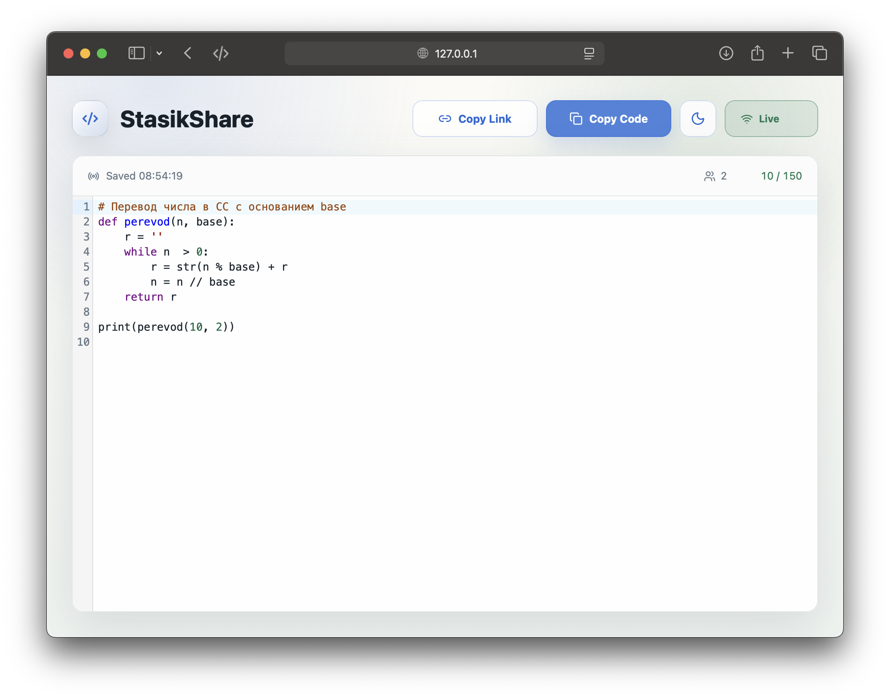
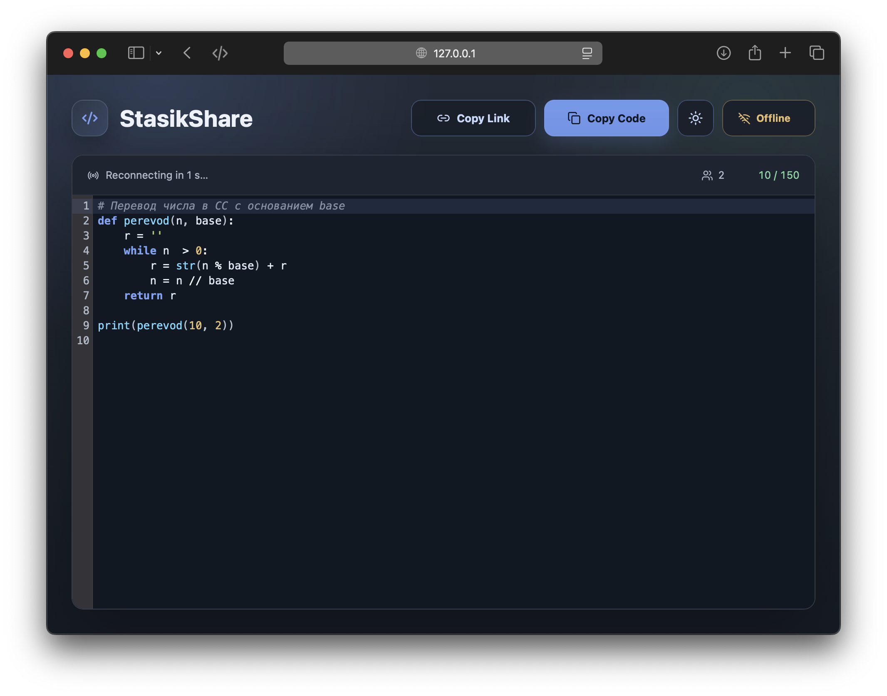

# LiveCode — локальный Live Share для Python

Браузерный редактор с live-синхронизацией `liveshare.py` между двумя компьютерами в одной локальной сети.



---

## Быстрый старт

**Учитель** (macOS/Linux):
```bash
./start_teacher.sh
# или
python start_teacher.py
```

**Ученик** (Windows):
```bat
start_student.bat 192.168.0.102
```
```bash
# или
python start_student.py 192.168.0.102
```

Если IP не передавать, скрипт спросит адрес и запомнит его на следующий раз в `~/.liveshare/config.json`.

---

## Архитектура проекта

```
livecode/
├── config.json              ← все настройки (лимит строк, порты и т.д.)
│
├── server/                  ← серверная часть (запускается только у учителя)
│   ├── config.py            ← чтение config.json, типизированные константы
│   ├── network.py           ← определение LAN IP
│   ├── ws_server.py         ← WebSocket-сервер синхронизации
│   └── http_server.py       ← HTTP-сервер, раздающий frontend/dist
│
├── client/                  ← клиентская часть (запускается у обоих)
│   ├── bridge.py            ← локальный HTTP-мост 127.0.0.1:8765 ↔ liveshare.py
│   └── startup.py           ← общие утилиты запуска (ожидание URL, thread-обёртки)
│
├── frontend/                ← React + Vite + CodeMirror
│   └── src/
│       ├── App.tsx          ← главный компонент
│       ├── types.ts         ← TypeScript-типы
│       ├── styles.css       ← светлая и тёмная тема
│       └── components/
│           └── Editor.tsx   ← CodeMirror-обёртка
│
├── start_teacher.py         ← запуск режима учителя
├── start_student.py         ← запуск режима ученика
├── start_teacher.sh         ← bash-обёртка с активацией venv
├── start_student.bat        ← Windows-обёртка для ученика
├── liveshare.py             ← синхронизируемый файл (редактируется совместно)
├── requirements.txt
└── build/                   ← PyInstaller spec-файлы
```

**Как данные движутся:**

```
Браузер учителя
  └─ WebSocket → ws_server.py → WebSocket → Браузер ученика
                     │
                  (каждый браузер)
                     │
                  bridge.py (127.0.0.1:8765)
                     │
                  liveshare.py (на диске)
```

---

## Настройка через config.json

Все параметры живут в `config.json` в корне проекта:

```json
{
  "max_lines": 150,
  "http_port": 8000,
  "ws_port": 5678,
  "bridge_port": 8765,
  "debounce_ms": 75,
  "autosave_ms": 10000,
  "shared_file": "liveshare.py"
}
```

| Поле         | Описание                               |
|--------------|----------------------------------------|
| `max_lines`  | Максимальное кол-во строк в редакторе  |
| `http_port`  | Порт web UI                            |
| `ws_port`    | Порт WebSocket-синхронизации           |
| `bridge_port`| Порт локального bridge                 |
| `debounce_ms`| Задержка перед отправкой (мс)          |
| `autosave_ms`| Интервал автосохранения (мс)           |
| `shared_file`| Имя синхронизируемого файла            |

---

## Требования

```
Python 3.8+
pip install -r requirements.txt

Node.js 18+ (только для сборки фронтенда)
```

## Сборка фронтенда

```bash
cd frontend
npm install
npm run build
cd ..
```

---

## Что умеет

- 🔄 **Live-синхронизация** по WebSocket с debounce из `config.json`
- 💾 **Автосохранение** в `liveshare.py` с интервалом из `config.json` + при закрытии вкладки
- 🌙 **Тёмная тема** с кнопкой переключения, запоминается в localStorage
- 👥 **Счётчик участников** в строке статуса
- ✍️ **Индикатор «кто-то печатает»** — пропадает через 2 секунды после остановки
- 📏 **Лимит строк** из `config.json` — блокирует ввод сверх лимита, предупреждает за 13 строк до предела
- 🔗 **Copy Link** — одна кнопка, чтобы скопировать ссылку для ученика
- 📋 **Copy Code** — скопировать весь текст редактора в буфер
- 🔒 **Race condition** на сервере решена через `asyncio.Lock` в `ws_server.py`

---

## Порты

| Порт | Назначение |
|------|-----------|
| `8000` | Web UI (настраивается в `config.json`) |
| `5678` | WebSocket-синхронизация |
| `8765` | Локальный bridge (только 127.0.0.1) |

### Важно про доступ из сети

На машине учителя HTTP-сервер и WebSocket-сервер слушают `0.0.0.0`, то есть принимают подключения со всех сетевых интерфейсов. Это нужно, чтобы ученик мог открыть редактор по LAN-ссылке, но вместе с этим порты `http_port` и `ws_port` становятся доступны другим устройствам в той же сети, если firewall их пропускает.

Локальный bridge слушает только `127.0.0.1` и наружу не открывается.

---

## Ограничения

- Стратегия конфликтов — **last write wins** (для двух участников этого достаточно). При внешнем обновлении редактор показывает уведомление, но не выполняет merge конфликтующих правок.
- Синхронизируется только один файл (`shared_file` из `config.json`).
- Локальный bridge (`8765`) слушает только на `127.0.0.1` — снаружи недоступен.

---

## Алиас для учителя (zsh)

```bash
alias liveshare='~/projects/livecode/start_teacher.sh'
```
